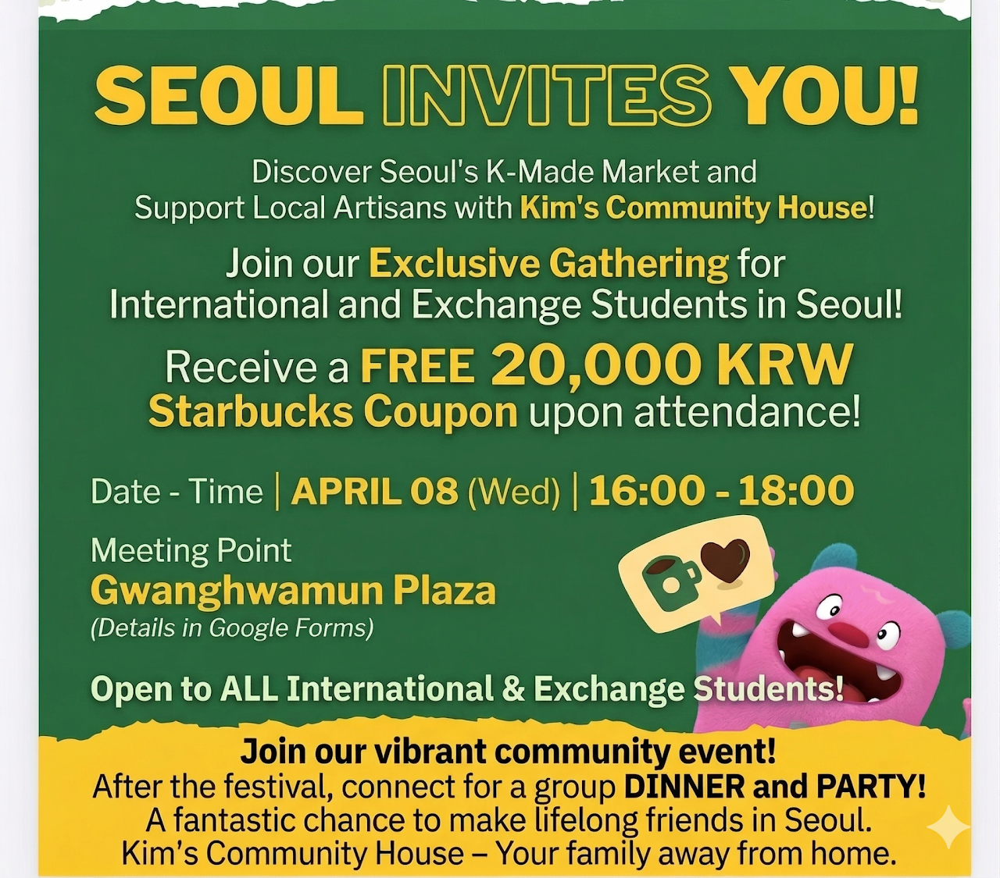

# Repository Structure & Conventions

A static site deployed via GitHub Pages. No build step. Edit, commit, push.

---

## Directory layout

```
.
├── index.html                  # Home (listing of trips)
├── about.html
├── house.html
├── 404.html
├── promo-may2026.html          # One-off promo / landing pages live in root
├── CNAME                       # GitHub Pages custom domain
├── favicon.png / favicon.svg / apple-touch-icon.png
│
├── docs/
│   └── instagram-caption-template.md  # Caption format for trip posts
│
├── css/
│   └── style.css               # Single global stylesheet
├── js/
│   └── main.js                 # Single global script (modal, scaler, mobile nav)
│
├── travel/                     # One file per trip — the trip detail page
│   ├── n100-seonbi-chunhyang-jeonju.html       (modern style: nXX-slug.html)
│   ├── n101-...                                 ...
│   └── 2024-chrysanthemum-festival.html        (legacy past trips)
│
├── posters/                    # Designed-for-Instagram poster + card files
│   ├── n100-instagram_poster_magazine-v2.html  # 1:1 magazine cover
│   ├── n100-poster-photo-v2.html               # 4:5 photo poster
│   ├── n100-poster-v3-Sources.html             # 1:1 editorial
│   ├── n100-card.css                           # Shared CSS for the 9 cards
│   ├── n100-card-01-buseoksa.html ... 09-...   # 1:1 destination cards
│   └── _archive/                               # Old / unused poster versions
│
└── images/
    ├── destinations/                           # ★ REUSABLE across trips ★
    │   ├── DESTINATIONS.md                     # ★ 한글 ↔ English folder dictionary ★
    │   ├── buseoksa-temple/
    │   │   ├── 01.jpg ... 15.jpg               # Numbered photo strip
    │   │   └── buseoksa-stairs.jpg             # Named hero / specialty shots
    │   ├── seonbi-culture-festival/
    │   ├── chunhyang-festival/
    │   └── ...
    ├── logo.jpg                                # Site UI assets
    ├── instagram.png / facebook.png            # Social icons
    ├── hero1.jpg / hero2.jpg / hero3.jpg       # Home page hero rotation
    └── kct-NN.jpg, n93.jpg, ...                # Legacy per-trip thumbnails
```

---

## Naming conventions

### Trip codes
Every modern trip has a sequential code prefix `nXX-`:
- `n93`, `n94`, ..., `n100`, `n101`, ...
- The number is monotonic; do not reuse a retired code.

### File names
- All paths use **kebab-case** (`buseoksa-temple`, not `BuseokSa_Temple`).
- Trip pages: `travel/nXX-short-slug.html`. Slug describes the trip in 2–4 words.
- Posters: `posters/nXX-poster-<variant>.html` where variant = `magazine`, `photo`, `editorial`, etc. *(In-progress — older files have inconsistent names; rename when you touch them.)*
- Cards: `posters/nXX-card-NN-<destination>.html` where NN is 2-digit (01–09).
- Card CSS: `posters/nXX-card.css` shared by that trip's cards.

### Image folders
- **Destination folders** are named by the destination, NOT by trip code: `images/destinations/buseoksa-temple/`. This way N105 can reuse the same folder.
- Photos inside a destination folder:
  - `01.jpg`, `02.jpg`, ... — ordered photo strip / gallery (zero-padded 2 digits)
  - `<descriptive-name>.jpg` — heroes, posters, specialty shots (e.g. `buseoksa-stairs.jpg`)
- **Korean ↔ English lookup:** `images/destinations/DESTINATIONS.md` maps every folder
  to its Korean name and common aliases (e.g. 미륵대원지 → `chungju-mireukdaewonji`).
  When searching for a destination by Korean name, check the dictionary first.
  When CREATING a destination folder, add its row in the same commit.

---

## Path rules

### From `travel/<page>.html`
Use **relative** paths going up one level:
```html
<link rel="stylesheet" href="../css/style.css">

<a href="../posters/n100-instagram_poster_magazine-v2.html">
```

### From `posters/<file>.html`
Use **absolute root** paths (poster files may be opened standalone OR iframed from any depth):
```html

```

### From `index.html` (root)
Use **relative** paths without leading slash:
```html
<a href="travel/n100-seonbi-chunhyang-jeonju.html">

```

---

## Adding a new trip — recipe

1. **Pick a code**: next available `nXX`.
2. **Create the trip page**: copy an existing modern trip (e.g. `travel/n100-seonbi-chunhyang-jeonju.html`) and rename to `travel/nXX-short-slug.html`. Update title, badge, schedule, registration link.
3. **For each destination**:
   - If it's already in `images/destinations/<name>/`, just reference the existing photos. ✅ no work needed
   - If it's new, create `images/destinations/<destination-name>/` and add numbered photos (`01.jpg`, `02.jpg`, ...) plus any named hero shots.
4. **Add the trip card** to `index.html` under "Next Trips".
5. **(Optional) Posters & cards**:
   - Copy an existing poster from `posters/` and adapt content.
   - For destination cards, copy `posters/n100-card-01-buseoksa.html` as a template and update text/photo refs.
   - Wire them into the trip page's `<div class="ig-html-grid">` block, with `data-poster-src`, `data-poster-w`, `data-poster-h`, `data-poster-title`.
6. **Instagram caption**: follow `docs/instagram-caption-template.md`; save the finished
   caption to the trip's Drive folder under `홍보/nXX-instagram-caption.txt`.

---

## Trip conventions

- **Meeting time**: 15 minutes before departure (occasionally 20 — confirm per trip).
  Default meeting point: **Yongsan Station Exit 1**. Standard wording everywhere
  (sidebar, schedule, captions):
  - Sidebar row: `07:15, Yongsan Station Exit 1` + small text `Depart 07:30 · Exact pin announced individually`
  - Schedule list: `07:15 — Meet at Yongsan Station Exit 1` then `07:30 — Depart Seoul`
- **Booking**: Google Form linked from the trip page (N100–N102 shared
  `https://forms.gle/UqeBK9evF6sRz1oh8`); participants must verify their name on the namelist.
- **Pricing patterns**: government-sponsored trips are either free or a small admin fee
  (historically 7–10 EUR for students / 20 EUR other foreigners). Emphasize FREE hard
  when it applies.
- **Audience**: foreigners & international students only; all public content in English,
  with Korean names alongside (see `images/destinations/DESTINATIONS.md`).

---

## Posters & cards

### Format (standing rule, June 2026)
All NEW posters and cards are **4:5 — 1080×1350** (Instagram portrait). 3:4 (1080×1440)
is an acceptable alternative if we switch later. **Do not create new 1:1 square posters**
— existing square files (N100–N102 magazine covers) are legacy. Carousel slides must all
share one aspect ratio; `data-poster-h` is 1350 for 4:5.

### Why iframes?
Each poster is its own standalone HTML file (so it renders properly when opened directly). Trip pages and the home page embed them via scaled iframes inside `.ig-html-wrap`, `.poster-iframe-wrap`, or `.trip-hero-poster`. The shared scaler in `js/main.js` (`ResizeObserver`) handles fitting them to their wrapper.

### Required `data-*` attributes on the wrap
For a tile to open in the modal:
```html
<a class="ig-html-wrap"
   href="../posters/<file>.html"
   data-poster-src="../posters/<file>.html"
   data-poster-w="1080"
   data-poster-h="1080"        <!-- 1350 for 4:5 photo posters -->
   data-poster-title="Short caption">
  <iframe src="../posters/<file>.html" scrolling="no" tabindex="-1"></iframe>
</a>
```

Add `ig-html-wrap--tall` for 4:5 posters.

### Poster body CSS (must be iframe-safe)
Every poster's `<body>` should have:
```css
body { margin: 0; padding: 0; overflow: hidden; }
```
**Do not** use `display: flex; align-items: center; justify-content: center` or `min-height: 100vh; padding: ...` on the body — they break iframe embedding (the poster gets cropped wrong inside the iframe).

---

## CSS / JS conventions

- **One stylesheet** (`css/style.css`); section-comment headers like `/* ─── INSTAGRAM POSTS SECTION ─── */`.
- **One script** (`js/main.js`); each feature in its own IIFE wrapped in `_kctReady()`.
- Class naming: BEM-ish — `.block`, `.block-element`, `.block--modifier`.
- Use CSS variables defined at `:root` (`--max-w`, `--dark`, `--mid`, `--light`, etc.) instead of hardcoded colors.

---

## Things to NOT do

- ❌ Don't put trip-specific images outside their destination folder.
- ❌ Don't hardcode `images/n100/...` — always use `images/destinations/<dest>/...`.
- ❌ Don't add personal docs / `.docx` / `.DS_Store` — `.gitignore` covers most, double-check `git status`.
- ❌ Don't load JS/CSS from CDNs unless absolutely necessary — keep the site self-contained.
- ❌ Don't add a build step (no webpack, no Vite). Static HTML/CSS/JS only.
